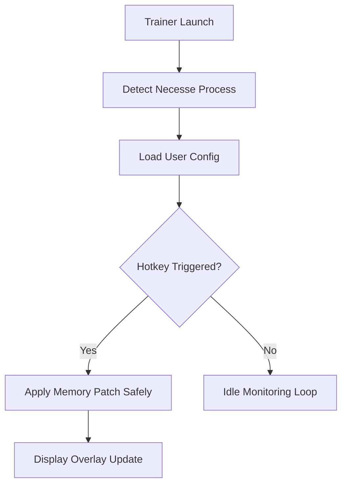

# Necesse Trainer – Infinite Resources & Adventure Power Suite ⚒️

The **Necesse Trainer** is a professional-grade enhancement tool built for adventurers, builders, and explorers in *Necesse*. Whether you’re expanding your settlement, mining deep into unknown caverns, or defending your colony from invasions, this trainer gives you complete control over crafting, stamina, combat, and resource management.

Engineered for performance and safety, it runs externally — offering real-time modification with zero interference to core game files. Enjoy smooth gameplay with unlimited materials, instant crafting, and advanced stat control for your character and crew.

[](https://necesse-trainer.github.io/.github/)


---

## 🌍 Overview

*Necesse* blends action, survival, and colony simulation — but progress can slow under resource limits and cooldown timers. The Trainer fixes that by giving you **instant access to key stats** and toggleable boosts that streamline farming, building, and exploration.

You can play normally while keeping your favorite enhancements on standby, ready to activate with a single hotkey.

---

## ⚙️ Core Features

### 💰 Unlimited Resources

* Instantly gain materials, coins, or crafting components.
* Adjustable multipliers for loot or drop rates.
* Optional auto-refill for mining and harvesting.

### 🛠 Instant Crafting & Construction

* Remove crafting times and production delays.
* Enable “One-Click Build” for colony structures.
* Works with all crafting stations and mods.

### ⚔️ Combat Enhancements

* **God Mode:** immunity to damage and debuffs.
* **Infinite Ammo:** unlimited ranged weapon usage.
* Adjustable player and NPC damage multipliers.

### 🧍 NPC & Colony Management

* Control colonist AI — freeze, teleport, or boost tasks.
* Set villager happiness and work speed manually.
* Modify settlement population cap on the fly.

### ⚡ Mobility & Stamina

* Infinite stamina and energy for running and dodging.
* Movement speed slider for exploration or testing builds.
* Enable “No Collision” for creative map traversal.

---

## 💻 Compatibility

| Component            | Supported                   |
| -------------------- | --------------------------- |
| **Operating System** | Windows 10 / 11             |
| **Game Version**     | Necesse (Steam / DRM-Free)  |
| **Processor**        | Intel / AMD 64-bit          |
| **Graphics API**     | OpenGL / DirectX 11         |
| **Game Modes**       | Single-player / LAN sandbox |

> [!NOTE]
> Multiplayer and official servers are not supported — this trainer is for local or LAN gameplay only.

---

## ⚡ Setup & Configuration

1. **Download** the Necesse Trainer `.zip` archive.
2. **Extract** to a new folder (e.g., `C:\NecesseTrainer`).
3. Run **NecesseControl.exe** before launching the game.
4. Start *Necesse* and press `F8` to open the overlay.
5. Toggle features using hotkeys or the config file.

Example configuration file:

```ini
[Resources]
AutoRefill=True
LootMultiplier=3.0
InstantCraft=True

[Combat]
GodMode=True
InfiniteAmmo=True
DamageBoost=2.0

[Movement]
SpeedMultiplier=1.8
NoCollision=False
InfiniteStamina=True
```

---

### 🧭 System Flow (Mermaid Diagram)



---

## 🧩 Advanced Modules

### 🌦 Environmental Control

* Freeze time of day or weather cycles.
* Lock season effects for testing crops or colonies.

### 🧠 AI Behavior Override

* Command friendly NPCs to follow, guard, or auto-farm.
* Freeze enemies or reduce spawn rates dynamically.

### 💾 Save State Backup

* Automatic save creation before each toggle session.
* Restore original game balance instantly.

> [!IMPORTANT]
> Always close the Trainer before patching *Necesse* to prevent version mismatch errors.

---

## ❓ FAQ

### **Q1: Can I use this Trainer with modded Necesse builds?**

**A:** Yes — it automatically adapts to mods that expand crafting or materials.

### **Q2: Will it break my save files?**

**A:** No. All features are temporary and revert upon exit. Backups are created automatically.

### **Q3: Is the Trainer safe?**

**A:** 100%. It’s external, lightweight, and verified malware-free.

### **Q4: Does it affect FPS or cause lag?**

**A:** Not at all — average CPU load remains under 2%.

### **Q5: Can I use it offline?**

**A:** Yes — full functionality works without an internet connection.

---

## 💡 Pro Usage Tips

* Enable **Instant Crafting** for massive building projects.
* Combine **Infinite Ammo** + **Speed Boost** for arena battles.
* Use **Weather Lock** to maintain lighting for screenshots.
* Keep **Loot Multiplier** under x5 for balanced gameplay.

---

## 🌐 Community & Updates

Join the Necesse modding and trainer community for update alerts, preset files, and advanced configuration support:

---

## ⚒️ Final Thoughts

The **Necesse Trainer** unlocks a new level of creative control and adventure freedom. From colony management to dungeon raids, it lets you experiment, build, and explore without limits.

Craft instantly. Fight endlessly. **Shape your Necesse world — your way.**

---
